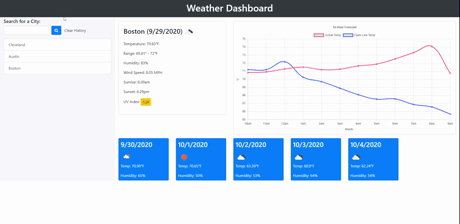

# Weather-Dashboard

## Description
By integrating third-party APIs into this site, I was able to send requests to remote servers and subsequently receive data in response. For the weather-dashboard, the several OpenWeather APIs were used to access daily and hourly weather statistics, as well as 5-day forecast and UV Index data. The city name, obtained from the user input, provided the value needed to fill in the required city parameter for all but the UV Index API. The latter required specific coordinates to access UV index data. These coordinates were obtained from the response received from each current day weather API call. 

The hourly temperature line chart was added to address human tendency to plan ahead. To those of you who plan for the day by looking at the hourly temperature forecast, this chart is for you. I also thought it'd be interesting to see how the actual temperature deviates from what the temperature feels like on an hourly basis. A drawback to this line chart is the missing "percent chance of precipitation" numbers. I thought about adding a third axis to represent percentages and adding transparent columns to indicate the likelihood of rain at any given hour, however I felt that would've put too much work on the user to decipher. Numbers and icons representing chances of rain are far easier to digest, I just couldn't figure out a clean way of incorporating them into the line chart. 

## Table of Contents
* Process
* Usage
* Credits
* Contributing
* License

## Process Overview
Figuring out how the API calls worked was one of the two biggest steps in creating this dashboard. Once I was able to map out the data provided from each call, creating the elements to display the appropriate statistics was relatively straightforward. The other big step was creating and displaying the line chart. The Canvas.js documentation was extraordinarily helpful by providing plenty of chart templates to work off of. The biggest hurdle in creating the chart was learning how to use the canvas tag. Before the graph can be put inside the canvas tag, we must specify '2d' as the getContext() function parameter... In hindsight this doesn't sound terribly difficult. 

## Usage
[Weather-Dashboard Link](https://kev-luo.github.io/Weather-Dashboard/)

To use the weather-dashboard, begin by searching a city located within the US. The site currently does not support searches outside the US. After hitting the enter button or clicking on the search button, the main dashboard will display current day weather statistics, a 12-hour line chart with the actual temperature and "feels like" temperature, as well as a 5-day forecast. All searches will be added to a list displayed below the search bar, making it easier to view the weather statistics of cities you've previously searched for. These searches are saved to local storage, so they will still be there the next time you open your browser. Clearing the history also erases the data from local storage. 

## Credits
The Chart.js library enabled me to create the line chart on my site with relative ease. Please see the following links for their documentation and Github page.

* [Chart.js Docs](https://www.chartjs.org/docs/latest/)
* [Chart.js Github](https://github.com/chartjs/Chart.js)

## Contributing
[contributor covenant](https://www.contributor-covenant.org/)

## License
© 2019 Trilogy Education Services, a 2U, Inc. brand. All Rights Reserved.

Licensed under the [MIT](https://github.com/microsoft/vscode/blob/master/LICENSE.txt) License.

